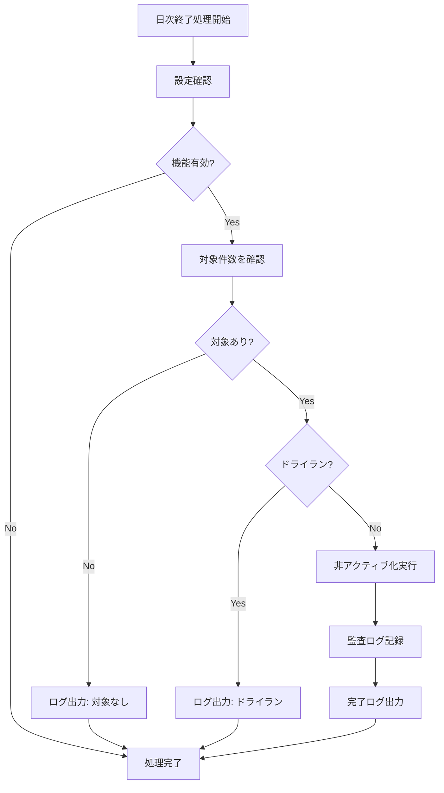

# 在庫ゼロ商品非アクティブ化機能

## 📋 概要

日次終了処理において、在庫がゼロかつ長期間取引のない商品を自動的に非アクティブ化する機能です。
大規模データ環境（10万件以上）でのパフォーマンス問題を解決し、アンマッチチェック等の処理速度を向上させます。

## 🎯 実装目的

- **パフォーマンス向上**: 消費済み在庫（9万件等）がアクティブ状態として残ることによる処理速度低下を解決
- **データベース最適化**: 不要なレコードを非アクティブ化して検索対象を削減
- **運用効率化**: 手動での在庫管理作業を軽減

## 📊 非アクティブ化条件

以下のすべての条件を満たす在庫マスタレコードが対象：

```sql
✓ CurrentStock = 0（現在庫ゼロ）
✓ PreviousMonthQuantity = 0（前月末在庫もゼロ）
✓ IsActive = 1（現在アクティブ）
✓ 最終更新日から180日以上経過
```

## 🔧 実装詳細

### 主要ファイル

| ファイル | 修正内容 |
|---------|---------|
| `IInventoryRepository.cs` | 非アクティブ化メソッドのインターフェース追加 |
| `InventoryRepository.cs` | SQL実装（件数確認・非アクティブ化処理） |
| `DailyCloseService.cs` | 日次終了処理への統合 |
| `DailyCloseResult.cs` | 結果モデルに非アクティブ化件数を追加 |
| `appsettings.json` | 設定項目の追加 |

### 設定項目

```json
{
  "InventorySystem": {
    "DailyClose": {
      "DeactivateZeroStock": {
        "Enabled": true,
        "InactiveDaysThreshold": 180,
        "IncludePreviousMonthCheck": true,
        "DryRunMode": false
      }
    }
  }
}
```

| 設定項目 | デフォルト値 | 説明 |
|---------|-------------|------|
| `Enabled` | `true` | 機能の有効/無効 |
| `InactiveDaysThreshold` | `180` | 非アクティブ化までの日数 |
| `IncludePreviousMonthCheck` | `true` | 前月末在庫のチェック有無 |
| `DryRunMode` | `false` | ドライラン（実際の更新を行わない） |

## 📈 処理フロー



## 🛠️ SQL クエリ

### 対象件数確認

```sql
SELECT COUNT(*)
FROM InventoryMaster
WHERE CurrentStock = 0
    AND ISNULL(PreviousMonthQuantity, 0) = 0
    AND IsActive = 1
    AND DATEDIFF(DAY, 
        COALESCE(UpdatedDate, JobDate), 
        @JobDate) >= @InactiveDays
```

### 非アクティブ化実行

```sql
UPDATE InventoryMaster
SET IsActive = 0,
    UpdatedDate = GETDATE()
WHERE CurrentStock = 0
    AND ISNULL(PreviousMonthQuantity, 0) = 0
    AND IsActive = 1
    AND DATEDIFF(DAY, 
        COALESCE(UpdatedDate, JobDate), 
        @JobDate) >= @InactiveDays
```

## 📊 パフォーマンス最適化

### インデックス追加

```sql
-- 非アクティブ化用インデックス
CREATE INDEX IX_InventoryMaster_Deactivation 
ON InventoryMaster(IsActive, CurrentStock, PreviousMonthQuantity, UpdatedDate) 
INCLUDE (JobDate, ProductCode, GradeCode, ClassCode, ShippingMarkCode, ShippingMarkName);

-- 一般的なパフォーマンス用インデックス
CREATE INDEX IX_InventoryMaster_IsActive_UpdatedDate 
ON InventoryMaster(IsActive, UpdatedDate);
```

## 🧪 テスト方法

### 1. 機能テスト

```bash
# ドライランモードでテスト
dotnet run dev-daily-close 2025-06-01 --dry-run

# 実際の非アクティブ化
dotnet run dev-daily-close 2025-06-01
```

### 2. SQLテスト

```bash
# テストクエリ実行
sqlcmd -S localhost\SQLEXPRESS -d InventoryManagementDB -i database/test_deactivation_queries.sql
```

### 3. 設定テスト

```bash
# 機能無効化テスト
# appsettings.json で "Enabled": false に設定後
dotnet run dev-daily-close 2025-06-01
```

## 📝 監査・ログ

### ProcessHistory テーブル

```sql
SELECT 
    ProcessDate,
    ProcessType,
    Status,
    Message,
    CreatedDate
FROM ProcessHistory
WHERE ProcessType = 'DEACTIVATE_ZERO_STOCK'
ORDER BY CreatedDate DESC;
```

### 非アクティブ化された商品確認

```sql
SELECT 
    ProductCode,
    ProductName,
    UpdatedDate,
    JobDate
FROM InventoryMaster
WHERE IsActive = 0
    AND UpdatedDate >= DATEADD(DAY, -1, GETDATE())
ORDER BY UpdatedDate DESC;
```

## 🔄 リカバリ手順

### 誤って非アクティブ化された商品の復活

```sql
-- 特定商品の復活
UPDATE InventoryMaster
SET IsActive = 1,
    UpdatedDate = GETDATE()
WHERE ProductCode = @ProductCode
    AND GradeCode = @GradeCode
    AND ClassCode = @ClassCode
    AND ShippingMarkCode = @ShippingMarkCode
    AND ShippingMarkName = @ShippingMarkName
    AND IsActive = 0;

-- 一括復活（注意：条件を慎重に設定）
UPDATE InventoryMaster
SET IsActive = 1,
    UpdatedDate = GETDATE()
WHERE IsActive = 0
    AND UpdatedDate >= '2025-07-12 00:00:00'  -- 対象日時を指定
    AND UpdatedDate <= '2025-07-12 23:59:59';
```

## ⚠️ 注意事項

### 運用時の注意

1. **段階的導入**
   - 最初は `DryRunMode: true` で動作確認
   - ログで影響範囲を確認後、本番実行

2. **閾値の調整**
   - 180日は標準値、業務特性に応じて調整
   - 季節商品等は除外条件の追加を検討

3. **パフォーマンス監視**
   - 大量データの場合は処理時間を監視
   - インデックスの効果を定期的に確認

### 将来の拡張計画

1. **設定の詳細化**
   - 商品カテゴリ別の閾値設定
   - 季節商品の除外フラグ

2. **通知機能**
   - 大量非アクティブ化時のアラート
   - 月次レポートへの組み込み

3. **自動再アクティブ化**
   - 仕入発生時の自動復活
   - 需要予測との連携

## 📞 サポート

問題が発生した場合：

1. ログファイルの確認
2. ProcessHistory テーブルの確認
3. 設定値の見直し
4. SQL実行計画の確認

---

**実装日**: 2025-07-12  
**バージョン**: v1.0  
**実装者**: Claude Code with Gemini CLI consultation