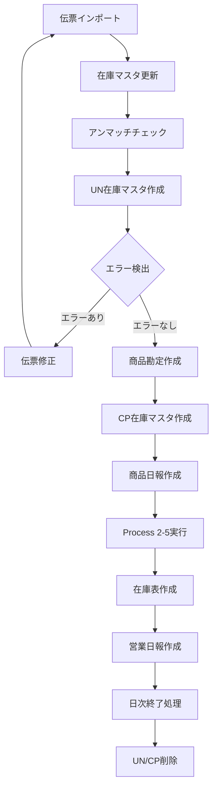

# 在庫管理システム開発 統合仕様書

**バージョン**: 3.0  
**最終更新**: 2025年9月16日  
**プロジェクトパス**: `../`

## 🎯 プロジェクト概要

食品販売業向けの在庫管理システムを開発します。販売大臣AXの外付けシステムとして、日々の在庫処理時間を**3時間55分から30分に短縮**することが目標です。

### 技術スタック
- **言語**: C# (.NET 8.0)
- **データベース**: SQL Server 2022 Express
- **帳票**: FastReport.NET Version 2024.1.3（正式ライセンス取得済み）
- **開発環境**: Visual Studio Code / Cursor
- **実行環境**: Windows Server 2022
- **アーキテクチャ**: コンソールアプリケーション

## 📂 プロジェクト構造

```
InventoryManagementSystem/
├── src/
│   ├── InventorySystem.Core/        # ビジネスロジック
│   ├── InventorySystem.Data/        # データアクセス層
│   ├── InventorySystem.Import/      # CSV取込処理
│   ├── InventorySystem.Reports/     # 帳票生成
│   │   ├── FastReport/              # FastReport実装
│   │   │   ├── Interfaces/          # 共通インターフェース
│   │   │   ├── Services/            # FastReportサービス
│   │   │   └── Templates/           # レポートテンプレート
│   │   ├── Interfaces/              # 帳票インターフェース
│   │   └── Services/                # プレースホルダー実装
│   └── InventorySystem.Console/     # バッチ処理
├── database/
│   ├── schema/                      # テーブル定義
│   ├── procedures/                  # ストアドプロシージャ
│   ├── functions/                   # ユーザー定義関数
│   └── migration/                   # マイグレーション
├── data/                           # データ格納用
│   ├── import/                     # CSV取込データ
│   ├── backup/                     # バックアップ
│   └── reports/                    # 帳票出力
└── tests/                          # テストコード
```

## 🔑 核心仕様 - 3つの在庫マスタ

### 在庫マスタの種類と役割

| 在庫マスタ種別 | テーブル名 | 用途 | 作成タイミング | 削除タイミング | データセット管理 |
|---------------|------------|------|----------------|----------------|----------------|
| **在庫マスタ** | InventoryMaster | 実在庫の原本管理 | 初期構築時 | なし（永続） | DataSetIDでスナップショット管理 |
| **UN在庫マスタ** | UnInventoryMaster | アンマッチチェック専用 | アンマッチリスト実行時 | ・実行時に既存削除<br>・日次終了時 | なし（使い捨て） |
| **CP在庫マスタ** | CpInventoryMaster | 帳票作成用 | 商品勘定作成時 | ・実行時に既存削除<br>・日次終了時 | なし（使い捨て） |

### 5項目複合キー（最重要）

```csharp
public class InventoryKey
{
    public string ProductCode { get; set; }       // 商品コード（5桁）
    public string GradeCode { get; set; }         // 等級コード（3桁）  
    public string ClassCode { get; set; }         // 階級コード（3桁）
    public string ShippingMarkCode { get; set; }  // 荷印コード（4桁）
    public string ShippingMarkName { get; set; }  // 荷印名（8桁固定）
}
```

**重要**: 荷印名は伝票の手入力項目から取得
- 売上伝票: 155列目（Index=154）
- 仕入伝票: 147列目（Index=146）  
- 在庫調整: 153列目（Index=152）

```csharp
// 荷印名の処理（8桁固定）
ShippingMarkName = (HandInputItem ?? "").PadRight(8).Substring(0, 8);
```

### JobDate（汎用日付2）の重要性

- **定義**: 販売大臣AXで実際にコンピュータ入力操作を行った日付
- **重要性**: 全ての処理の基準日（伝票日付ではない）
- **ルール**: 絶対に改変しない、CSVの値をそのまま使用

## 🔄 処理フロー

### 全体処理フロー



### 日次運用コマンド

```bash
# 1. データインポート
dotnet run -- import-folder DeptA 2025-06-30

# 2. アンマッチチェック
dotnet run -- unmatch-list 2025-06-30

# 3. 商品勘定作成（CP在庫マスタ作成）
dotnet run -- product-account 2025-06-30

# 4. 商品日報作成（Process 2-5自動実行）
dotnet run -- daily-report 2025-06-30

# 5. 在庫表作成
dotnet run -- inventory-list 2025-06-30

# 6. 営業日報作成
dotnet run -- business-daily-report 2025-06-30

# 7. 日次終了処理
dotnet run -- daily-closing 2025-06-30
```

## 📥 CSV取込機能（import-folder）

### CSV仕様
- **文字コード**: UTF-8 with BOM
- **区切り文字**: カンマ
- **ヘッダー**: あり（1行目）
- **改行コード**: CRLF

### 取込対象ファイル

| ファイル種別 | ファイル名パターン | 重要列 |
|------------|------------------|-------|
| 売上伝票 | 売上伝票_YYYYMMDD.csv | 155列目:荷印名 |
| 仕入伝票 | 仕入伝票_YYYYMMDD.csv | 147列目:荷印名 |
| 在庫調整 | 受注伝票_YYYYMMDD.csv | 153列目:荷印名 |
| 商品マスタ | 商品.csv | - |
| 得意先マスタ | 得意先.csv | - |
| 仕入先マスタ | 仕入先.csv | - |
| 等級マスタ | 等級汎用マスター１.csv | 全角数字使用 |
| 階級マスタ | 階級汎用マスター２.csv | 全角数字使用 |
| 荷印マスタ | 荷印汎用マスター３.csv | 全角数字使用 |

### 除外データ条件

```csharp
// 共通除外条件
if (productCode == "00000") continue;
if (customerCode == "00000") continue;  // 売上伝票
if (supplierCode == "00000") continue;  // 仕入伝票

// アンマッチリスト専用除外
if (divisionCode == "2" || divisionCode == "5") continue;  // ギフト経費、加工費B
if (shippingMarkName.StartsWith("EXIT") || shippingMarkName.StartsWith("exit")) continue;
if (shippingMarkCode == "9900" || shippingMarkCode == "9910" || shippingMarkCode == "1353") continue;
```

### データ格納ディレクトリ

```
D:\InventoryImport\
├── DeptA\                        # 部門別フォルダ
│   ├── Import\                   # CSV取込先（監視対象）
│   ├── Processed\                # 処理済みCSV
│   │   └── 2025-06-26\          # YYYY-MM-DD形式
│   └── Error\                    # エラーCSV
└── Share\                        # 共有フォルダ
    └── AddonData\                # 販売大臣AX出力先
```

## 📋 アンマッチリスト（unmatch-list）

### 目的
**「明らかな伝票入力ミスを検出してリストにする」**

### 処理フロー

```csharp
public async Task<UnmatchListResult> ExecuteAsync(DateTime jobDate)
{
    // 1. 既存UN在庫マスタ削除
    await _unInventoryRepository.TruncateAsync();
    
    // 2. UN在庫マスタ作成（入荷データのみ集計）
    await CreateUnInventoryMasterAsync(jobDate);
    
    // 3. アンマッチチェック実行
    var unmatchData = await CheckUnmatchAsync(jobDate);
    
    // 4. FastReportでPDF出力
    var pdf = await GeneratePdfAsync(unmatchData, jobDate);
    
    return new UnmatchListResult { 
        UnmatchCount = unmatchData.Count,
        PdfData = pdf 
    };
}
```

### 入荷・出荷の判定

```csharp
// 入荷データ（UN在庫マスタに集計）
bool IsIncomingData(VoucherType type, decimal quantity)
{
    return (type == VoucherType.Sales && quantity < 0) ||      // 売上返品
           (type == VoucherType.Purchase && quantity > 0) ||    // 通常仕入
           (type == VoucherType.Adjustment && quantity > 0);    // 入荷調整
}

// 出荷データ（アンマッチチェック対象）
bool IsOutgoingData(VoucherType type, decimal quantity)
{
    return (type == VoucherType.Sales && quantity > 0) ||      // 通常売上
           (type == VoucherType.Purchase && quantity < 0) ||    // 仕入返品
           (type == VoucherType.Adjustment && quantity < 0);    // 出荷調整
}
```

### エラー判定
- **E01**: 在庫マスタ無（UN在庫マスタにKeyが存在しない）
- **マイナス在庫はOK**（エラーとしない）

## 💰 Process 2-5（粗利計算処理）

### 処理概要
売上伝票への粗利付込とCP在庫への粗利集計、歩引き額計算

### 粗利計算ロジック

```csharp
// 第1段階：基本粗利計算
public decimal CalculateGrossProfit(SalesVoucherDetail detail, decimal inventoryUnitPrice)
{
    // 単価が0の場合の特殊処理
    decimal unitPrice = detail.UnitPrice;
    if (unitPrice == 0 && detail.Amount != 0 && detail.Quantity != 0)
    {
        unitPrice = Math.Round(detail.Amount / detail.Quantity, 4);
    }
    
    // 例外処理：商品分類5が99999の場合
    if (detail.ProductClassification5 == "99999")
    {
        return 0;
    }
    
    // 粗利計算
    return Math.Round((unitPrice - inventoryUnitPrice) * detail.Quantity, 2);
}

// 歩引き金計算
public decimal CalculateWalkingAmount(decimal salesAmount, decimal walkingRate)
{
    return Math.Round(salesAmount * walkingRate / 100, 0);
}

// 奨励金計算（仕入先分類1='01'のみ）
public decimal CalculateIncentive(decimal purchaseAmount, string supplierClass1)
{
    if (supplierClass1 == "01")
    {
        return Math.Round(purchaseAmount * 0.01M, 0);
    }
    return 0;
}
```

### 売上伝票への書き込み

```csharp
// 汎用数値1（126列目）：明細行ごとの粗利益
salesVoucher.GenericNumeric1 = grossProfit;

// 汎用数値2（127列目）：計算した歩引き金
salesVoucher.GenericNumeric2 = walkingAmount;
```

### 第2段階：調整後粗利計算

```csharp
// CP在庫マスタでの集計
調整後粗利益 = 当日粗利益 - 当日在庫調整金額 - 当日加工費
```

## 📊 商品日報（daily-report）

### 仕様
- **用紙**: A3横向き（420mm × 297mm）
- **フォント**: ＭＳ ゴシック
- **構成**: 日計と月計を左右に並列表示
- **Process 2-5**: 自動実行される

### レイアウト

```
※ YYYY年MM月DD日 商 品 日 報 ※

商品名 | 売上数量 | 売上金額 | 仕入値引 | 在庫調整 | 加工費 | 振替 | 奨励金 | １粗利益 | １粗利率 | ２粗利益 | ２粗利率 || 月計売上 | 月１粗利 | 月１率 | 月２粗利 | 月２率
```

### 特殊表示（負の値）

```csharp
// 商品日報のみ：負の値は▲を右側に表示
public string FormatNegativeValue(decimal value)
{
    if (value < 0)
    {
        return $"{Math.Abs(value):#,##0}▲";
    }
    return value.ToString("#,##0");
}
```

### 処理実装

```csharp
public async Task<byte[]> GenerateDailyReportAsync(DateTime jobDate)
{
    // 1. Process 2-5を自動実行
    await _process25Service.ExecuteAsync(jobDate);
    
    // 2. CP在庫マスタからデータ取得
    var cpInventoryData = await _cpInventoryRepository.GetByJobDateAsync(jobDate);
    
    // 3. 商品分類1でグループ化
    var groupedData = cpInventoryData
        .GroupBy(x => x.ProductClassification1)
        .OrderBy(g => g.Key);
    
    // 4. FastReportでPDF生成
    return await GeneratePdfAsync(groupedData, jobDate);
}
```

## 📋 商品勘定（product-account）

### 仕様
- **用紙**: A3横向き（420mm × 297mm）
- **目的**: 商品別の仕入・売上・在庫の動きを一覧表示
- **重要**: CP在庫マスタをここで初めて作成

### CP在庫マスタ作成処理

```csharp
public async Task<byte[]> GenerateProductAccountAsync(DateTime jobDate)
{
    // 1. 既存CP在庫マスタを削除
    await _cpInventoryRepository.TruncateAsync();
    
    // 2. 在庫マスタからCP在庫マスタへコピー
    await ExecuteStoredProcedureAsync("sp_CreateCpInventoryFromInventoryMaster", 
        new { JobDate = jobDate });
    
    // 3. CP在庫マスタからデータ取得
    var cpInventoryData = await _cpInventoryRepository.GetAllAsync();
    
    // 4. 移動平均法による在庫単価計算
    foreach (var item in cpInventoryData)
    {
        item.CurrentInventoryUnitPrice = CalculateMovingAveragePrice(
            item.PreviousQuantity, 
            item.PreviousAmount,
            item.IncomingQuantity, 
            item.IncomingAmount);
    }
    
    // 5. 帳票作成
    return await GeneratePdfAsync(cpInventoryData, jobDate);
}
```

### 移動平均法による在庫単価計算

```csharp
public decimal CalculateMovingAveragePrice(
    decimal previousQty, decimal previousAmount,
    decimal incomingQty, decimal incomingAmount)
{
    decimal totalQty = previousQty + incomingQty;
    
    // 0除算対策
    if (totalQty == 0) return 0;
    
    decimal totalAmount = previousAmount + incomingAmount;
    return Math.Round(totalAmount / totalQty, 4, MidpointRounding.AwayFromZero);
}
```

## 📈 在庫表（inventory-list）

### 仕様
- **用紙**: A4縦向き
- **目的**: 現在の在庫状況を担当者別・商品別に表示
- **特徴**: 滞留警告マーク表示

### 滞留警告マーク

```csharp
public string GetStagnationMark(DateTime lastReceiptDate, DateTime currentDate)
{
    int days = (currentDate - lastReceiptDate).Days;
    
    if (days >= 31) return "!!!";
    if (days >= 21) return "!!";
    if (days >= 11) return "!";
    return "";
}
```

### 処理実装

```csharp
public async Task<byte[]> GenerateInventoryListAsync(DateTime jobDate)
{
    // CP在庫マスタから直接データ取得（商品勘定で作成済み）
    var cpInventoryData = await _cpInventoryRepository.GetAllAsync();
    
    if (!cpInventoryData.Any())
    {
        throw new InvalidOperationException(
            "CP在庫マスタが作成されていません。先に商品勘定を実行してください。");
    }
    
    // 担当者・商品でソート
    var sortedData = cpInventoryData
        .Where(x => x.PreviousDayQuantity > 0)  // 前日在庫0は除外
        .OrderBy(x => x.PersonInCharge)
        .ThenBy(x => x.ProductCode);
    
    return await GeneratePdfAsync(sortedData, jobDate);
}
```

## 📊 営業日報（business-daily-report）

### 仕様
- **用紙**: A3横向き（420mm × 297mm）
- **ページ数**: 3ページ（分類01-08、09-17、18-26）
- **特徴**: 得意先分類1・仕入先分類1別の売上仕入集計

### テーブル構造

```sql
CREATE TABLE BusinessDailyReport (
    ClassificationCode NVARCHAR(3) NOT NULL PRIMARY KEY,
    CustomerClassName NVARCHAR(12),
    SupplierClassName NVARCHAR(12),
    
    -- 日計項目（16項目）
    DailyCashSales DECIMAL(19,2),
    DailyCashSalesTax DECIMAL(19,2),
    DailyCreditSales DECIMAL(19,2),
    DailySalesDiscount DECIMAL(19,2),
    DailyCreditSalesTax DECIMAL(19,2),
    DailyCashPurchase DECIMAL(19,2),
    DailyCashPurchaseTax DECIMAL(19,2),
    DailyCreditPurchase DECIMAL(19,2),
    DailyPurchaseDiscount DECIMAL(19,2),
    DailyCreditPurchaseTax DECIMAL(19,2),
    DailyCashReceipt DECIMAL(19,2),
    DailyBankReceipt DECIMAL(19,2),
    DailyOtherReceipt DECIMAL(19,2),
    DailyCashPayment DECIMAL(19,2),
    DailyBankPayment DECIMAL(19,2),
    DailyOtherPayment DECIMAL(19,2)
    -- 月計・年計も同じ構造
);
```

### 集計ルール（伝票種×明細種）

```csharp
// 売上伝票の集計
Dictionary<(int voucherType, int detailType), string> salesMapping = new()
{
    { (52, 1), "DailyCashSales" },     // 現金売上
    { (52, 2), "DailyCashSales" },
    { (52, 3), "DailyCashSales" },
    { (52, 4), "DailyCashSales" },
    { (52, 18), "DailyCashSalesTax" }, // 現売消費税
    { (51, 1), "DailyCreditSales" },   // 掛売上
    { (51, 2), "DailyCreditSales" },   // 売上返品
    { (51, 3), "DailySalesDiscount" }, // 売上値引
    { (51, 4), "DailySalesDiscount" },
    { (51, 18), "DailyCreditSalesTax" } // 掛売消費税
};
```

## 🖨️ FastReport.NET実装

### 基本設定

```csharp
#if WINDOWS
public class FastReportService : IReportService
{
    public async Task<byte[]> GenerateReportAsync(string templateName, object data)
    {
        using var report = new Report();
        report.Load($"Templates/{templateName}.frx");
        report.RegisterData(data, "ReportData");
        report.Prepare();
        
        using var ms = new MemoryStream();
        using var pdfExport = new PDFExport();
        report.Export(pdfExport, ms);
        
        return ms.ToArray();
    }
}
#else
public class PlaceholderReportService : IReportService
{
    public async Task<byte[]> GenerateReportAsync(string templateName, object data)
    {
        throw new PlatformNotSupportedException("FastReportはWindows環境でのみ利用可能");
    }
}
#endif
```

### テンプレートファイル

| 帳票名 | テンプレートファイル | サイズ |
|-------|-------------------|--------|
| アンマッチリスト | UnmatchListReport.frx | A3横 |
| 商品日報 | DailyReport.frx | A3横 |
| 商品勘定 | ProductAccount.frx | A3横 |
| 在庫表 | InventoryList.frx | A4縦 |
| 営業日報 | BusinessDailyReport.frx | A3横 |

## 🔧 共通インターフェース

### IReportService（帳票基底）

```csharp
public interface IReportService
{
    Task<ReportResult> GenerateAsync(DateTime jobDate, string dataSetId = null);
    Task<ValidationResult> ValidateDataAsync(DateTime jobDate);
    string GetReportName();
}
```

### IInventoryCalculator（在庫計算）

```csharp
public interface IInventoryCalculator
{
    decimal CalculateMovingAveragePrice(
        decimal previousQty, decimal previousAmount,
        decimal incomingQty, decimal incomingAmount);
    
    GrossProfitResult CalculateGrossProfit(
        decimal salesPrice, decimal inventoryPrice,
        decimal quantity, decimal discountRate);
}
```

### ICsvImportService（CSV取込）

```csharp
public interface ICsvImportService<T>
{
    Task<ImportResult> ImportAsync(string filePath, DateTime? jobDate = null);
    Task<ValidationResult> ValidateAsync(T entity);
    string GetEntityName();
}
```

## 🏃 パフォーマンス最適化

### バッチ処理

```csharp
// 1000件単位でバッチ処理
const int BATCH_SIZE = 1000;

public async Task ProcessLargeDataAsync<T>(IEnumerable<T> data, Func<T, Task> processor)
{
    var batches = data.Chunk(BATCH_SIZE);
    
    foreach (var batch in batches)
    {
        using var transaction = await _connection.BeginTransactionAsync();
        try
        {
            foreach (var item in batch)
            {
                await processor(item);
            }
            await transaction.CommitAsync();
        }
        catch
        {
            await transaction.RollbackAsync();
            throw;
        }
    }
}
```

### SqlBulkCopy使用

```csharp
public async Task BulkInsertAsync<T>(IEnumerable<T> data, string tableName)
{
    var dataTable = ConvertToDataTable(data);
    
    using var bulkCopy = new SqlBulkCopy(_connectionString)
    {
        DestinationTableName = tableName,
        BatchSize = 10000,
        BulkCopyTimeout = 600
    };
    
    await bulkCopy.WriteToServerAsync(dataTable);
}
```

## 🐛 エラーハンドリング

### 0除算対策（必須）

```csharp
public decimal SafeDivide(decimal dividend, decimal divisor)
{
    if (divisor == 0) return 0;
    return Math.Round(dividend / divisor, 4, MidpointRounding.AwayFromZero);
}
```

### トランザクション管理

```csharp
public async Task<T> ExecuteInTransactionAsync<T>(Func<Task<T>> operation)
{
    using var transaction = await _connection.BeginTransactionAsync();
    try
    {
        var result = await operation();
        await transaction.CommitAsync();
        return result;
    }
    catch (Exception ex)
    {
        await transaction.RollbackAsync();
        _logger.LogError(ex, "トランザクション実行中にエラーが発生しました");
        throw;
    }
}
```

## 📝 SQL管理

### ストアドプロシージャ一覧

| プロシージャ名 | 用途 | パラメータ |
|---------------|------|-----------|
| sp_CreateUnInventoryMaster | UN在庫マスタ作成 | @JobDate |
| sp_CreateCpInventoryFromInventoryMaster | CP在庫マスタ作成 | @JobDate |
| sp_CalculateMovingAveragePrice | 移動平均単価計算 | @JobDate |
| sp_UpdateGrossProfit | 粗利益更新 | @JobDate |
| sp_ClearDailyArea | 営業日報日計クリア | なし |
| sp_DailyClosing | 日次終了処理 | @JobDate |

### インデックス設計

```sql
-- 5項目複合キーインデックス
CREATE INDEX IX_InventoryMaster_CompositeKey 
ON InventoryMaster(
    ProductCode, GradeCode, ClassCode, 
    ShippingMarkCode, ShippingMarkName
);

-- JobDateインデックス
CREATE INDEX IX_InventoryMaster_JobDate 
ON InventoryMaster(JobDate);

-- 伝票検索用インデックス
CREATE INDEX IX_SalesVouchers_JobDate 
ON SalesVouchers(JobDate) INCLUDE (VoucherType, DetailType);
```

## ✅ 実装チェックリスト

### Phase 1: 基盤構築
- [ ] データベース作成（3つの在庫マスタ）
- [ ] CSV取込基盤実装
- [ ] 5項目複合キーの処理実装
- [ ] JobDate処理の実装

### Phase 2: 品質チェック
- [ ] UN在庫マスタ作成処理
- [ ] アンマッチリスト機能
- [ ] エラー判定ロジック

### Phase 3: 帳票作成
- [ ] CP在庫マスタ作成処理
- [ ] 商品勘定実装
- [ ] Process 2-5実装
- [ ] 商品日報実装
- [ ] 在庫表実装
- [ ] 営業日報実装

### Phase 4: 最適化
- [ ] バッチ処理実装
- [ ] インデックス最適化
- [ ] パフォーマンステスト
- [ ] 日次終了処理実装

## 🔍 トラブルシューティング

### CP在庫マスタ未作成エラー
```sql
-- CP在庫マスタ確認
SELECT COUNT(*) FROM CpInventoryMaster;

-- 対処：商品勘定を実行
dotnet run -- product-account 2025-06-30
```

### アンマッチ重複表示
```sql
-- UN在庫マスタの重複チェック
SELECT ProductCode, GradeCode, ClassCode, 
       ShippingMarkCode, ShippingMarkName, COUNT(*)
FROM UnInventoryMaster
GROUP BY ProductCode, GradeCode, ClassCode, 
         ShippingMarkCode, ShippingMarkName
HAVING COUNT(*) > 1;
```

### Process 2-5エラー
```sql
-- 売上伝票の粗利確認
SELECT VoucherNumber, ProductCode, 
       GenericNumeric1 as GrossProfit,
       GenericNumeric2 as WalkingAmount
FROM SalesVouchers
WHERE JobDate = '2025-06-30'
  AND GenericNumeric1 IS NULL;
```

## 📊 データ量の目安

| データ種別 | 日次件数 | 年間累計 |
|-----------|---------|----------|
| 売上伝票 | 500-1,200件 | 約30万件 |
| 仕入伝票 | 200-400件 | 約10万件 |
| 在庫マスタ | 100-200件 | 約1万件（ユニーク） |
| CP在庫マスタ | 100-200件 | 使い捨て |
| UN在庫マスタ | 50-100件 | 使い捨て |
| アンマッチ件数 | 0-20件 | - |

## 🎯 パフォーマンス目標

| 処理 | 現状 | 目標 | 備考 |
|-----|------|------|------|
| 全体処理 | 3時間55分 | 30分以内 | 87%削減 |
| CSV取込 | 30分 | 5分以内 | - |
| アンマッチ | 15分 | 3分以内 | - |
| 各帳票 | 20分 | 5分以内 | - |
| 日次終了 | 60分 | 5分以内 | - |

## ⚠️ 重要な注意事項

1. **FastReport.NETは絶対に削除・置換しない**
2. **JobDateは絶対に改変しない**
3. **0除算対策は全ての計算処理に実装**
4. **荷印名は8桁固定（伝票の手入力項目から取得）**
5. **UN在庫マスタとCP在庫マスタは使い捨て（DataSetIDなし）**
6. **商品日報実行時にProcess 2-5を自動実行**
7. **マイナス在庫はエラーとしない**
8. **商品コード「00000」は処理しない**

---

**この仕様書に基づいて、並列処理可能な形で各機能を実装してください。**