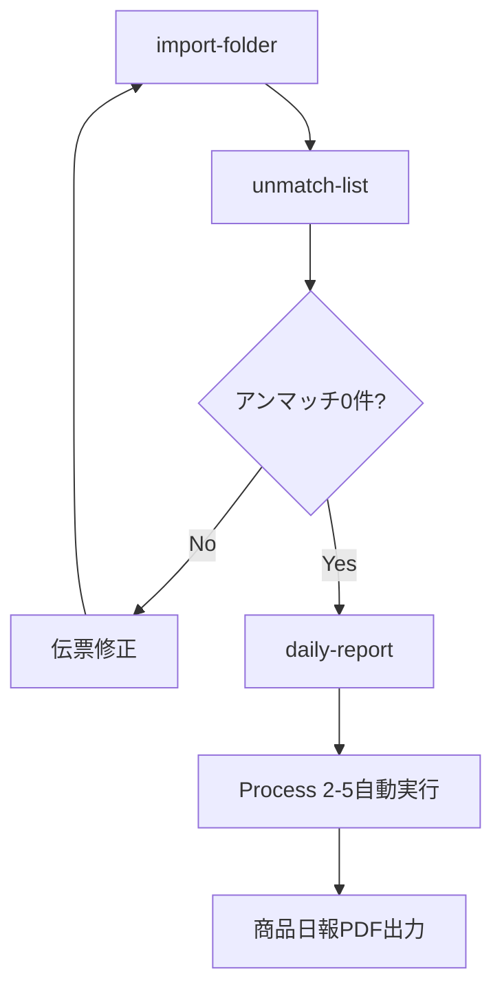

# SE2専用 開発ガイド - 商品日報 + Process 2-5担当

**ロール**: SE2（System Engineer 2）  
**担当機能**: 商品日報作成 + Process 2-5実装  
**最終更新**: 2025年7月31日
プロジェクトパス：./  （元: ../InventoryManagementSystem/）

---

## 🎯 SE2の責任範囲

### 主要担当機能
1. **商品日報作成**（daily-report）
   - FastReport.NETによるPDF出力
   - 2段階粗利計算結果の表示
   - 日計・月計の並列表示
   - 商品分類1（担当者）ごとの帳票作成

2. **Process 2-5実装**（粗利・歩引き計算）
   - 売上伝票1行ごとの粗利計算
   - 売上伝票への粗利益・歩引き金付け込み
   - CP在庫マスタへの集計処理
   - 奨励金計算（仕入伝票）

---

## 🏗️ アーキテクチャ理解（重要）

### SE2とCP在庫マスタの関係
```
【CP在庫マスタ】CpInventoryMaster
├─ 作成責任: SE3（商品勘定・在庫表担当）
├─ 使用権限: SE2（商品日報作成時に利用）
└─ 削除責任: SE3（日次終了処理時）

【Process 2-5の実行タイミング】
import-folder    : 実行しない
unmatch-list     : 実行しない
daily-report     : 自動実行（SE2担当）
product-account  : 実行しない（SE3が別途実行）
process-2-5      : 単独実行可能（SE2担当）
```

### コマンド実行順序


---

## 💰 Process 2-5 詳細仕様

### 処理概要
**「売上伝票への粗利付込とCP在庫にその粗利集計、および売上伝票の金額から得意先の歩引き率から歩引き額を計算しCP在庫Mの当日歩引き額へ集計する」**

### 処理フロー
```
1. 売上伝票を読み込み（処理2-2と同じ条件）
2. CP在庫Mの当日在庫単価から粗利益を計算  
3. 粗利益をCP在庫の当日粗利益に集計
4. 売上伝票に1行ごとの粗利益をセット
5. 得意先マスタを参照して歩引き金計算
6. 売上伝票に歩引き金をセット
7. 仕入伝票から奨励金計算（別処理2-6）
```

### 粗利計算ロジック
```csharp
// 基本粗利計算
decimal grossProfit = (salesUnitPrice - inventoryUnitPrice) * quantity;

// 単価が0の場合の特殊処理
if (salesUnitPrice == 0 && salesAmount != 0)
{
    decimal calculatedUnitPrice = Math.Round(salesAmount / quantity, 4);
    grossProfit = (calculatedUnitPrice - inventoryUnitPrice) * quantity;
}

// 例外処理：商品分類5が99999の場合
if (productClassification5 == "99999")
{
    grossProfit = 0;
    walkingRate = 0;
}
```

### 歩引き金計算
```csharp
// 得意先マスタの汎用数値1から歩引き率取得
decimal walkingRate = customerMaster.GenericNumeric1 ?? 0;

// 歩引き金計算
decimal walkingAmount = Math.Round(salesAmount * walkingRate / 100, 0);
```

### 売上伝票への書き込み（重要）
```csharp
// 2025年7月10日変更事項
// 126汎用数値1：明細行ごとの粗利益
salesVoucher.GenericNumeric1 = grossProfit;

// 127汎用数値2：計算した歩引き金
salesVoucher.GenericNumeric2 = walkingAmount;
```

### 奨励金計算（Process 2-6）
```csharp
// 仕入先分類1が'01'の場合のみ
if (supplierClassification1 == "01")
{
    decimal incentive = Math.Round(purchaseAmount * 0.01M, 0);
    // CP在庫Mの当日奨励金に加算
}
```

---

## 📊 商品日報仕様

### 基本レイアウト
- **用紙**: A3横向き（420mm × 297mm）
- **フォント**: ＭＳ ゴシック
- **構成**: 日計と月計を左右に並列表示

### 表示項目（左から順）
#### 日計エリア
1. 商品名
2. 売上数量（ZZ,ZZ9.99-）
3. 売上金額（ZZ,ZZZ,ZZ9-）
4. 仕入値引（ZZ,ZZZ,ZZ9-） 
5. 在庫調整（ZZ,ZZZ,ZZ9-）
6. 加工費（Z,ZZZ,ZZ9-）
7. 振替（Z,ZZZ,ZZ9-）
8. 奨励金（Z,ZZZ,ZZ9-）
9. １粗利益（ZZ,ZZZ,ZZ9-）
10. １粗利率（ZZ9.99-%）
11. ２粗利益（ZZ,ZZZ,ZZ9-）
12. ２粗利率（ZZ9.99-%）

#### 月計エリア
13. 売上金額（ZZZ,ZZZ,ZZ9-）
14. １粗利益（ZZ,ZZZ,ZZ9-）
15. １粗利率（ZZ9.99-%）
16. ２粗利益（ZZ,ZZZ,ZZ9▲-）
17. ２粗利率（ZZ9.99-%）

### 特殊表示仕様（重要）
```csharp
// 負の値の表示：▲記号を数値の右側に表示
public string FormatNumberWithTriangle(decimal value)
{
    if (value < 0)
    {
        return $"{Math.Abs(value):#,##0.00}▲";
    }
    return value.ToString("#,##0.00");
}

// 粗利率の計算
public string FormatRate(decimal grossProfit, decimal salesAmount)
{
    if (salesAmount == 0) return "0.00%";
    decimal rate = Math.Round((grossProfit / salesAmount) * 100, 2);
    return rate < 0 ? $"{Math.Abs(rate):0.00}▲%" : $"{rate:0.00}%";
}
```

### グループ制御
```csharp
// 商品分類1（担当者）ごとにページブレイク
// オペレータが都度指示して出力する機能
public class DailyReportGrouping
{
    public string ProductClassification1 { get; set; }  // 商品分類1（担当者）
    public string ProductCode { get; set; }            // 商品コード
    public string ShippingMarkCode { get; set; }       // 荷印コード
    public string ShippingMarkName { get; set; }       // 荷印名（手入力）
    public string GradeCode { get; set; }              // 等級コード
    public string ClassCode { get; set; }              // 階級コード
}
```

---

## 🔄 2段階粗利計算の理解

### 第1段階粗利（１粗利益）
```
基本粗利 = (売上単価 - 在庫単価) × 数量
```
- Process 2-5で売上伝票1行ごとに計算
- CP在庫マスタに集計

### 第2段階粗利（２粗利益）
```
最終粗利 = 当日粗利益 - 当日在庫調整金額 - 当日加工費
```
- CP在庫マスタで商品別に調整
- 在庫調整や加工費による影響を反映

### 粗利率計算
```csharp
// １粗利率
decimal grossProfitRate1 = (salesAmount != 0) ? 
    Math.Round((grossProfit1 / salesAmount) * 100, 2) : 0;

// ２粗利率  
decimal grossProfitRate2 = (salesAmount != 0) ? 
    Math.Round((grossProfit2 / salesAmount) * 100, 2) : 0;
```

---

## 🖨️ FastReport.NET実装

### テンプレート仕様
- **ファイル**: `DailyReport.frx`
- **データソース**: CP在庫マスタ
- **ページ設定**: A3横向き（1512px幅）
- **エンコーディング**: UTF-8対応

### Windows環境での実装
```csharp
#if WINDOWS
public class DailyReportFastReportService : IDailyReportService
{
    public async Task<byte[]> GenerateDailyReportAsync(DateTime reportDate, string productClassification1 = null)
    {
        // CP在庫マスタからデータ取得
        var reportData = await GetDailyReportDataAsync(reportDate, productClassification1);
        
        // FastReportでPDF生成
        using var report = new Report();
        report.Load(templatePath);
        report.RegisterData(reportData, "DailyReportData");
        report.Prepare();
        
        return ExportToPdf(report, reportDate);
    }
}
#endif
```

### Linux環境での対応
```csharp
#if !WINDOWS
public class DailyReportPlaceholderService : IDailyReportService
{
    public async Task<byte[]> GenerateDailyReportAsync(DateTime reportDate, string productClassification1 = null)
    {
        throw new PlatformNotSupportedException("FastReport.NETはWindows環境でのみ利用可能です");
    }
}
#endif
```

---

## 💻 SE2の実装すべきクラス・メソッド

### 1. Process 2-5関連
```csharp
// SE2が実装・保守する主要クラス
├── Process25Service.cs                  // Process 2-5制御
├── GrossProfitCalculationService.cs     // 粗利計算ロジック
├── WalkingRateCalculationService.cs     // 歩引き金計算
├── IncentiveCalculationService.cs       // 奨励金計算
└── SalesVoucherUpdateService.cs         // 売上伝票更新
```

### 2. 商品日報関連
```csharp
// SE2が実装・保守する主要クラス
├── DailyReportService.cs                // 商品日報制御
├── DailyReportDataService.cs            // データ取得・加工
├── DailyReportFastReportService.cs      // FastReport PDF生成
└── DailyReportPlaceholderService.cs     // Linux環境用
```

### 3. 重要なインターフェース
```csharp
public interface IProcess25Service
{
    Task ExecuteAsync(DateTime jobDate, string dataSetId);
}

public interface IDailyReportService
{
    Task<byte[]> GenerateDailyReportAsync(DateTime reportDate, string productClassification1 = null);
    Task<DailyReportData> GetDailyReportDataAsync(DateTime reportDate, string productClassification1 = null);
}
```

---

## 🔄 SE間の連携ポイント

### SE1（Import・アンマッチ担当）との連携
- アンマッチ0件確認後にdaily-reportコマンド実行可能
- JobDate（汎用日付2）の厳守

### SE3（商品勘定・在庫表担当）との連携
- CP在庫マスタはSE3が作成・削除責任
- SE2はCP在庫マスタを**読み取り専用**で使用
- Process 2-5実行時にCP在庫マスタを更新

### PM（全体管理）との連携
- 商品日報のレイアウト変更は相談
- Process 2-5の計算ロジック変更は影響範囲確認

---

## 🧪 テスト・デバッグ手順

### 1. Process 2-5単独テスト
```bash
# 1. CP在庫マスタが存在することを確認
dotnet run check-data-status 2025-06-01

# 2. Process 2-5単独実行
dotnet run process-2-5 2025-06-01

# 3. 売上伝票の粗利益・歩引き金確認
# SQL: SELECT 汎用数値1, 汎用数値2 FROM SalesVouchers
```

### 2. 商品日報生成テスト
```bash
# 1. 商品日報作成（Process 2-5も自動実行）
dotnet run daily-report 2025-06-01

# 2. 特定担当者のみ
dotnet run daily-report 2025-06-01 --classification1 "01"

# 3. PDF出力確認
# → daily_report_20250601_*.pdf が生成される
```

### 3. データ確認用SQL
```sql
-- CP在庫マスタの粗利集計確認
SELECT 
    ProductCode,
    ShippingMarkName,
    DailyGrossProfit1,
    DailyGrossProfit2,
    DailyWalkingAmount,
    DailyIncentive
FROM CpInventoryMaster 
WHERE JobDate = '2025-06-01'
ORDER BY ProductCode, ShippingMarkName;

-- 売上伝票の粗利付け込み確認
SELECT 
    VoucherNumber,
    ProductCode,
    Amount,
    GenericNumeric1 as GrossProfit,
    GenericNumeric2 as WalkingAmount
FROM SalesVouchers 
WHERE JobDate = '2025-06-01'
  AND GenericNumeric1 IS NOT NULL;
```

---

## ⚠️ SE2専用の注意事項

### 1. Process 2-5の実行タイミング
- **daily-reportコマンド内で自動実行**（最重要）
- import-folderコマンドでは実行しない
- アンマッチ0件確認後のみ実行可能

### 2. CP在庫マスタの扱い
- SE2は**読み取り専用**（作成・削除はSE3の責任）
- Process 2-5実行時のみ更新権限あり
- CP在庫マスタが存在しない場合はエラー

### 3. FastReport.NET使用時の注意
```csharp
// Windows環境優先
#if WINDOWS
    // FastReport実装
#else
    // プレースホルダー実装
#endif

// 日本語フォント設定必須
Font = "ＭＳ ゴシック, 8pt"
```

### 4. 負の値表示の特殊仕様
- **商品日報のみ**：負の値は▲を右側に表示

---

出典: se2/CLAUDE.md（このファイルへ統合）

